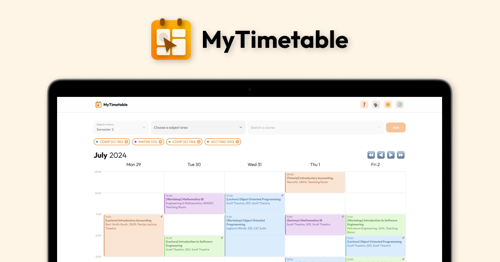

# MyTimetable



A drag-and-drop timetable planner for University of Adelaide students.

## Development

1. Install the dependencies

```sh
pnpm i
```

2. Copy `.env.example` to a new file `.env`

3. Run the development server

```sh
pnpm run dev
```

4. Open <http://localhost:5173> with your browser to see the result.

5. (Optional) Run the tests

```sh
pnpm run test
```
